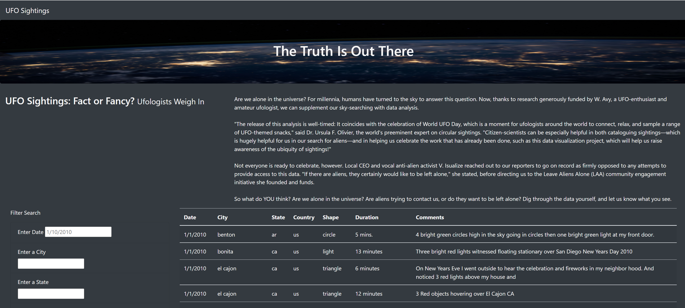

# UFO Sightings Search

## Introduction

In this repository, we've created an interactive webpage for users to view and search for UFO sightings.  The page is built using JavaScript, Boostrap,  HTML, and CSS.  The site allows a user to search based on sighting date, city, state, country and/or shape.  The dataset is a static dataset we are accessing.  Below is a snapshot of the website:

## Search Instructions
Below is the full set of search criteria available:

### Filter Values
To use the search criteria pictured on the left, follow the instructions below:   

* Enter Date - This is an exact match on the Sighting Date.  Enter the date in the MM/DD/YYYY format.
* Enter a City - This is an exact match on the City the sighting was observed in.  City names are all in lower case.
* Enter a State - This is the state abreviation for the sighting location.  The abbreviation is all lower case.
* Enter a Country - This is the country from the observation.  The country is all in lower case.
* Enter a Shape - Search for the shape using all lower case. Examples of shapes include (circle, light, triangle, unknown, fireball, formation, sphere, disk, chevron, cross, flash, changing, oval, etc.)

### Multi-value search
Multiple filters can be applied to your search.  As you enter the values, the table will filter down for each search. If you want all values, clear out the entries and it will list the full dataset. 

## Summary

While there is easy access to data on this website, there are drawbacks to the current design.  The filters are very specific on what they search for which makes broad research type inquiries more difficult.  The dataset is also static which is not ideal for doing recent searches.  I would recommend that the data pull data from some type of data source that is regularly updated.  

I'd recommend the following changes to make the site more useable:

* Add a button to clear filters.
* Add a calendar function to select a date.
* Provide a date range to search for more than a specific date.
* Apply logic to the values entered so comparisons on mixed case does not affect the results.
* Change the "Shape" search to a multi-select box or listing where the user can filter on multiple shapes with a known list of options.
