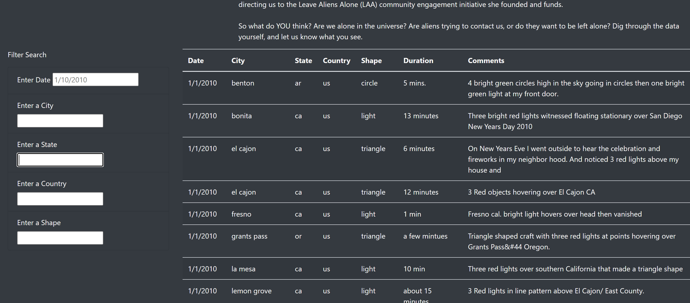

# UFO Search Site

# Introduction

In this repository, we've created an interactive webpage for users to view and search for UFO sightings.  The page is built using JavaScript, Boostrap,  HTML, and CSS.  The site allows a user to search based on sighting date, city, state, country and/or shape.  The dataset is a static dataset we are accessing.  Below is a snapshot of the website:

# Search Instructions
Below is the full set of search criteria available:

To use the search criteria pictured on the left, follow the instructions below.  Multiple filters can be applied to your search.

* Enter Date - This is an exact match on the Sighting Date.  Enter the date in the MM/DD/YYYY format.
* Enter a City - This is an exact match on the City the sighting was observed in.  City names are all in lower case.
* Enter a State - This is the state abreviation for the sighting location.  The abbreviation is all lower case.
* Enter a Country - This is the country from the observation.  The country is abbreviated and is all in lower case.

In this module, you'll build a table using data stored in a JavaScript array. You'll also create filters to make this table fully dynamic, meaning that it will react to user input, and then place the table into an HTML file for easy viewing.

You'll customize your webpage using Bootstrap, and equip your table with several fully functional filters that will allow users to interact with our visualizations. Watch the video to learn more about the specific data project you'll be working on.
